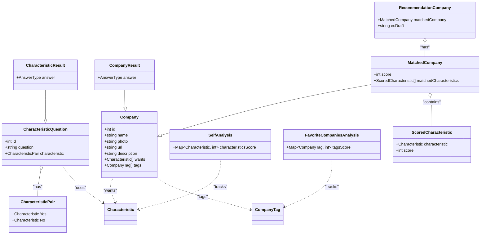

```mermaid
classDiagram
    %% 基本型・列挙
    class CharacteristicPair {
        +Characteristic Yes
        +Characteristic No
    }
    
    %% 質問関連
    class CharacteristicQuestion {
        +int id
        +string question
        +CharacteristicPair characteristic
    }
    class CharacteristicResult {
        +AnswerType answer
    }
    CharacteristicResult --|> CharacteristicQuestion
    CharacteristicQuestion o-- CharacteristicPair : "has"

    %% 企業関連
    class Company {
        +int id
        +string name
        +string photo
        +string url
        +string description
        +Characteristic[] wants
        +CompanyTag[] tags
    }
    class CompanyResult {
        +AnswerType answer
    }
    CompanyResult --|> Company

    %% 自己分析・企業分析
    class SelfAnalysis {
        +Map~Characteristic, int~ characteristicsScore
    }
    class FavoriteCompaniesAnalysis {
        +Map~CompanyTag, int~ tagsScore
    }

    %% スコアリング
    class ScoredCharacteristic {
        +Characteristic characteristic
        +int score
    }
    class MatchedCompany {
        +int score
        +ScoredCharacteristic[] matchedCharacteristics
    }
    MatchedCompany --|> Company
    MatchedCompany o-- ScoredCharacteristic : "contains"

    %% 推薦結果
    class RecommendationCompany {
        +MatchedCompany matchedCompany
        +string esDraft
    }
    RecommendationCompany o-- MatchedCompany : "has"

    %% 型の関係
    CharacteristicQuestion ..> Characteristic : "uses"
    SelfAnalysis ..> Characteristic : "tracks"
    FavoriteCompaniesAnalysis ..> CompanyTag : "tracks"
    Company ..> Characteristic : "wants"
    Company ..> CompanyTag : "tags"
```